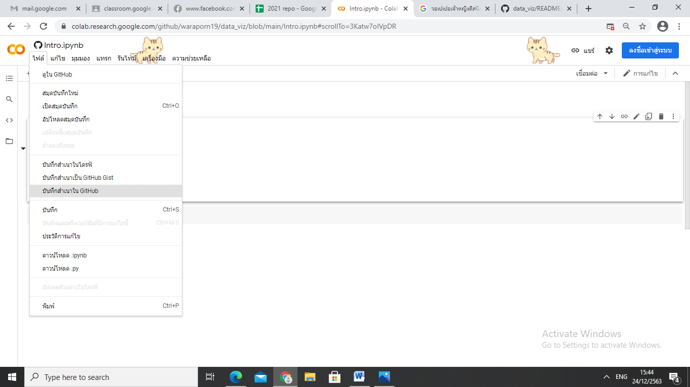

# data_viz
# วราภรณ์ สิทธิวงษ์ 613021022-0

## ตัวอย่างแทรกรูป

## HW ขั้นตอนการบันทึกcollab  มาไว้ที่ Github

### ขั้นตอนที่ 1 ให้ทำการเลือกที่ ' ไฟล์ '  จากนั้นไปกดเลือกที่ 'บันทึกสำเนาใน Github'

### ขั้นตอนที่ 2 จะปรากฎดังรูป จะมีช่อง ' ข้อความคอมมิต ' ให้เราเขียนข้อความว่าการบันทึกครั้งนี้เราทำอะไรเพิ่มบ้าง ซึ่งเราได้ทำการเขียนว่า first python notebook
### ขั้นตอนที่ 3 แล้วกด ตกลง  ก็เป็นอันว่าบันทึกเสร็จสิ้น

